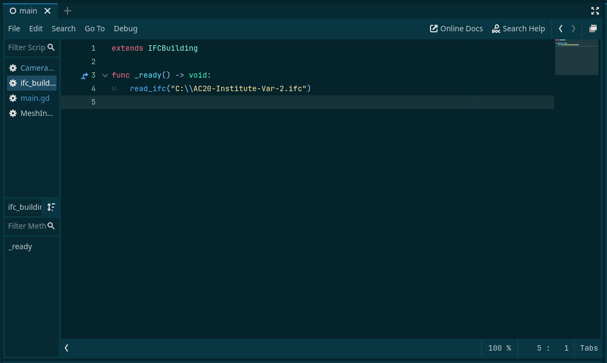
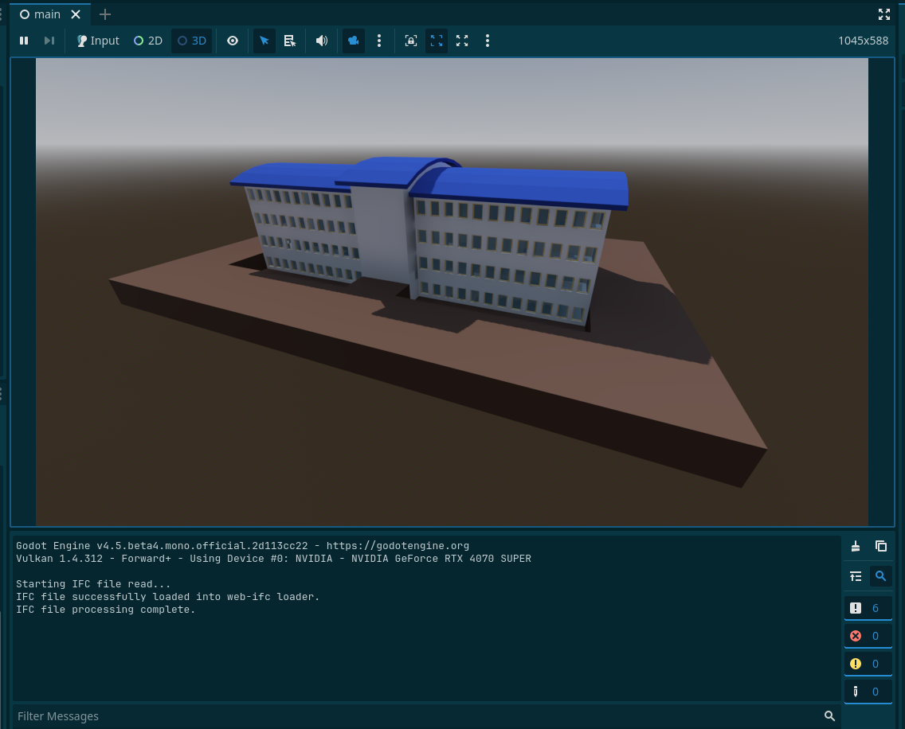

# GDIFC v0.0.1

A reader for the buildingSMART Industry Foundation Classes (IFC) format.

It gives you the IfcBuilding node capable of reading the IFC file geometries as meshes within the 3D nodes.

## Using

Create a IfcBuilding node and call its `read_ifc` method, passing the path of the IFC file.

```
extends IFCBuilding

func _ready() -> void:
	read_ifc("PATH")
```



> the model currently loads at runtime, and you can save it as a new scene in the remote tree, but we are working on multiple alternatives.



## Supported Platforms
- [ ] Windows 32 bit
- [x] Windows 64 bit
- [ ] Linux 32 bit
- [ ] Linux 64 bit
- [ ] macOS
- [ ] Android
- [ ] iOS

## Dependencies 

The code uses the awesome [web-ifc](https://github.com/ThatOpen/engine_web-ifc) library to create the meshes.

## Development

This initial version is only able to read the geometry of the file and some minor alphanumerical information.

The next steps is to work on the alphanumerical information and spatial structure of the generated node.
