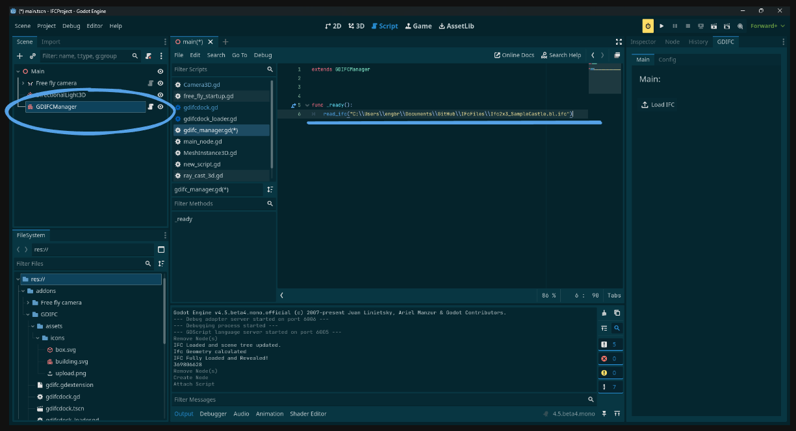
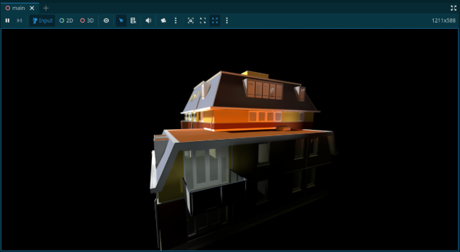
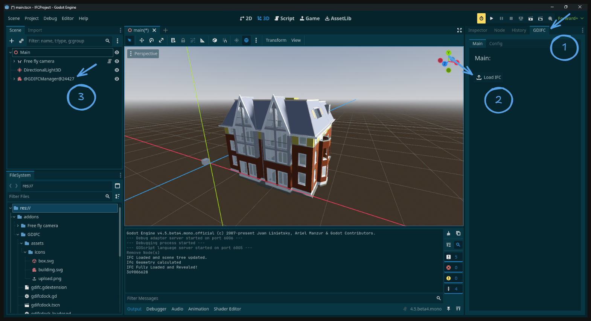

# GDIFC v0.0.2

A reader for the buildingSMART Industry Foundation Classes (IFC) format.

It gives you the IfcBuilding node capable of reading the IFC file geometries as meshes within the 3D nodes.

> [!NOTE]
> The goal of this extension is to enable developers to create games, applications, simulations and other things in Godot. Therefore, the core features to be implemented will be restricted to the processing, generation of geometry and retrieval of alphanumerical information from the models. Features such as camera movement and measurement are going to be developed as separate plugins/components.

## Using

### Reading at runtime 

Create a GDIFCManager node and call its `read_ifc` method, passing the path of the IFC file.

```
extends GDIFCManager

func _ready() -> void:
	read_ifc("PATH")
```
You can also create collisions automatically for some IfcObjects:

```
extends GDIFCManager

func _ready() -> void:
	var collision_objects = ["IfcWall","IfcSlab"]
	read_ifc("PATH", true, collision_objects)
```
> [!WARNING]
> Since the extension is in its early development, the API can still change on the next versions. However, a documentation page can come soon.




### Using the panel



## New features
- The manager can create collisions automatically based on a list of IfcObjects
- New UI panel to read the IFCs in engine without the function
- Implementation of assync loading, so the engine and/or game doesn't freeze at loading
- The manager emits a signal "ifc_read" when the model is correctly loaded
- Property sets can be now retrieved from IFCNodes with the method "get_properties" (they are also available in the inspector if you open with the panel)
- Added support for IFC 4.3.2.0
- The extension now adopts the addon folder, as mentioned in [#1](https://github.com/Muniz1994/GDIFCpub/issues/1)
- And other minor changes

> [!IMPORTANT]
> If you have some problems with the extension, ideas for new features or to change existing ones, don't hesitate to create an issue.

## Supported IFC versions
- [x] [IFC 2.3.0.1](https://standards.buildingsmart.org/IFC/RELEASE/IFC2x3/TC1/HTML/)
- [x] [IFC 4.0.2.1](https://standards.buildingsmart.org/IFC/RELEASE/IFC4/ADD2_TC1/HTML/)
- [x] [IFC 4.3.2.0](https://standards.buildingsmart.org/IFC/RELEASE/IFC4_3/)

## Supported Platforms
- [ ] Windows 32 bit
- [x] Windows 64 bit
- [ ] Linux 32 bit
- [ ] Linux 64 bit
- [ ] macOS
- [ ] Android
- [ ] iOS

## Dependencies 

The code uses:
- [web-ifc](https://github.com/ThatOpen/engine_web-ifc) library to create the meshes.
- IfcParse, from [IfcOpenShell](https://github.com/IfcOpenShell/IfcOpenShell) to handle the alphanumerical information

## Development

This extension is currently in early stages of development. Some of the next things to implement will probably be:
- Support to georreference on IFC4+
- Get quantity sets
- Implement the spatial structure
- Customization on the types of node to be created (e.g. implement elements as SoftBody or RigidBody)
- Integration of the main development repository into this one
